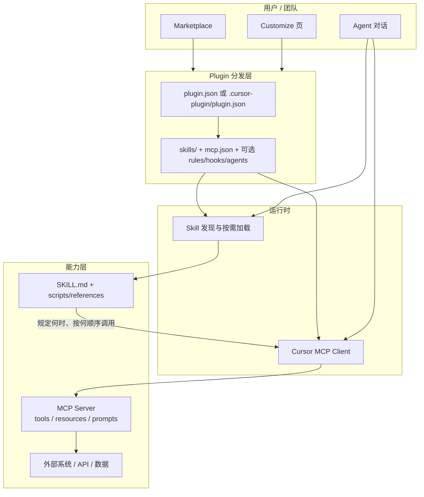
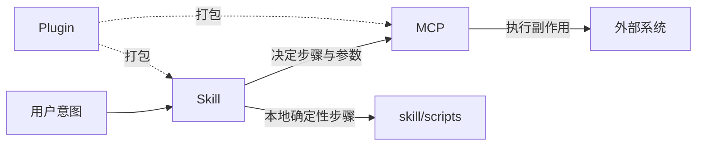

# MCP、Plugin、Skill：关系调研与本仓库开发指南

> 调研日期：2026-08-21  
> 目的：在动手写代码之前，把三套扩展机制的职责、组合方式和本仓库落地顺序说清楚。  
> 范围：以 Cursor 生态为主，同时对齐 MCP / Agent Skills / Agent Plugins 三套开放标准。

---

## 为什么先把关系讲清楚

Cursor Agent 默认已经能做很多事：读仓库、改文件、跑终端、搜网页。真正卡住它的，通常不是「不会写代码」，而是下面三类缺口：

1. **够不到编辑器外面的系统**。数据库、工单、设计稿、内部 API 都不在仓库里。
2. **不知道该按什么流程用这些系统**。即使工具已经挂上，Agent 仍可能漏步骤、乱调用、把参考代码当最终产物。
3. **装不上、带不走、发不出去**。个人目录里散落的配置，没法给同事一键安装，也没法做成可发布产品。

这三件事分别对应三套机制：

| 缺口 | 机制 | 它解决什么 |
|------|------|------------|
| 够不到外部系统 | **MCP** | 把外部能力变成 Agent 可调用的工具 / 资源 / 提示 |
| 不知道怎么正确用 | **Skill** | 把领域知识和工作流写进 `SKILL.md`，按需加载 |
| 装不上、带不走 | **Plugin** | 把 MCP + Skill（以及 Cursor 专属的 rules / hooks / agents）打成一个安装包 |

一句话：**MCP 给手，Skill 给脑，Plugin 给盒子。**

市场上成熟的官方插件几乎都按这个配方来。Figma 插件的描述就是「Plugin that includes the Figma MCP server and Skills for common workflows」。Cursor 自己的说法更直白：多数插件本质上就是 MCP + Skill 的组合。

本仓库后续要做的，不是三套互不相关的东西，而是同一条产品线的三层。

---

## 一张图看完三者关系



运行时顺序通常是：

1. Plugin 被安装（或本地 symlink 到 `~/.cursor/plugins/local`）。
2. Cursor 发现 `mcp.json`，拉起或连接 MCP Server，把 tools 挂进 Agent。
3. Cursor 发现 `skills/*/SKILL.md`，把 `name` + `description` 注入系统提示（约 100 token / skill）。
4. 用户说话后，Agent 判断要不要读完整 `SKILL.md`。
5. Skill 指导 Agent 去调哪些 MCP tools、先调哪个、返回值怎么用。
6. MCP Server 真正去碰外部系统。

没有 Plugin 也能单独用 MCP 或 Skill。Plugin 不是运行时必需品，它是**打包和分发**。

---

## 1. MCP：给 Agent 一双手

### 1.1 它是什么

[Model Context Protocol](https://modelcontextprotocol.io/docs/getting-started/intro) 是开放标准，官方类比是「AI 应用的 USB-C」。你写一次 Server，任何支持 MCP 的 Client（Cursor、Claude、VS Code、ChatGPT 等）都能连。

在 Cursor 里，Agent 是 Client，你的服务是 Server。Server 通过协议暴露三类能力：

| 能力 | 含义 | 典型用途 |
|------|------|----------|
| **Tools** | 模型可调用的函数（默认需用户批准） | 查库、建工单、改 Figma 节点 |
| **Resources** | 可读取的结构化数据 | 文档、schema、当前选中对象 |
| **Prompts** | 预置工作流模板 | 「开始 code review」「导入这个设计」 |

Cursor 还支持协议扩展 **MCP Apps**（工具可顺带返回可交互 UI），以及 Roots、Elicitation。本仓库第一期以 Tools 为主即可。

### 1.2 传输方式

Cursor 支持三种 transport：

| Transport | 适合什么 | 认证 | 注意 |
|-----------|----------|------|------|
| **stdio** | 本机进程，Cursor 帮你拉起 | env / API key | **禁止往 stdout 打日志**，会污染 JSON-RPC |
| **Streamable HTTP** | 远程或多用户服务 | OAuth / headers | 当前推荐的远程方式 |
| **SSE** | 旧远程方式 | OAuth | 已过时，新项目不要用 |

开发期建议先做 **stdio**（本地最快），稳定后再拆成 HTTP 服务。Agent Plugins 标准里对应的 type 分别是 `stdio`、`streamable-http`、`sse`。

### 1.3 在 Cursor 里怎么挂上

两条路，效果相同：

**A. 配置文件（开发期首选）**

- 项目级：`.cursor/mcp.json`
- 用户级：`~/.cursor/mcp.json`

```json
{
  "mcpServers": {
    "explore": {
      "command": "node",
      "args": ["${workspaceFolder}/mcp/dist/index.js"],
      "env": {
        "API_KEY": "${env:EXPLORE_API_KEY}"
      }
    }
  }
}
```

远程示例：

```json
{
  "mcpServers": {
    "explore": {
      "url": "http://localhost:3000/mcp",
      "headers": {
        "Authorization": "Bearer ${env:EXPLORE_API_KEY}"
      }
    }
  }
}
```

可用插值：`${env:NAME}`、`${userHome}`、`${workspaceFolder}`、`${workspaceFolderBasename}`、`${pathSeparator}`。

**B. Plugin 内的 `mcp.json`**

装插件时一起带上。Figma 就是远程 HTTP：

```json
{
  "mcpServers": {
    "figma": {
      "type": "http",
      "url": "https://mcp.figma.com/mcp"
    }
  }
}
```

### 1.4 写一个好 MCP 的标准

Cursor 官方指南把「好 Server」和「吵 Server」分得很清楚：

- 工具数量要少，名字要能让模型一眼知道何时该调。
- 每个 tool 的 description 写清 **做什么 + 何时用 + 不要用它做什么**。
- 不要把底层 REST 一对一暴露成 80 个 tools；按 Agent 任务聚合成 5–15 个动作。
- 密钥走 env / OAuth / Plugin variables，绝不写进仓库。
- stdio 日志只写 stderr。
- 一个 Server 挂了不应拖垮其它 Server（Cursor 会隔离失败）。

调试：Cursor Output 面板选 **MCP Logs**。Customize 里可以单独开关某个 Server。

### 1.5 官方能力清单（Cursor 已支持）

Tools、Prompts、Resources、Roots、Elicitation、MCP Apps。  
本仓库第一期做 Tools + 必要的 Resources 就够。

---

## 2. Skill：给 Agent 一套可加载的脑

### 2.1 它是什么

[Agent Skills](https://agentskills.io) 是开放标准。一个 Skill 就是一个目录，核心是 `SKILL.md`：YAML frontmatter + Markdown 说明书。它可以带 `scripts/`、`references/`、`assets/`。

Skill **不是**新的运行时协议。它不直接调 API。它教 Agent：

- 什么时候该用自己
- 步骤顺序是什么
- 该调哪些 MCP tools（或本地脚本）
- 返回值怎么解读
- 常见失败怎么恢复

Figma 把这件事做到了极致：`figma-design-to-code` 的 description 直接写「**MUST** invoke this skill BEFORE calling `get_design_context`」。MCP 给了 `get_design_context` 这只手，Skill 规定了「先调它、把它当参考而不是最终代码、先复用项目已有组件」。没有这条 Skill，Agent 很容易拿着工具乱打。

Chorus 也是同一模式：MCP 提供 `chorus_claim_task` 等工具，`develop` Skill 规定 `claim → in_progress → report → submit for verify` 这条状态机。

### 2.2 发现位置

Cursor 启动时从这些目录递归找 `SKILL.md`：

| 位置 | 范围 |
|------|------|
| `.cursor/skills/`、`.agents/skills/` | 当前项目 |
| `~/.cursor/skills/`、`~/.agents/skills/` | 用户全局 |
| Plugin 内的 `skills/` | 随插件安装 |
| `.claude/skills/`、`.codex/skills/` 及用户目录对应路径 | 兼容 Claude / Codex |

注意：

- Skill 身份来自**含有 `SKILL.md` 的那一层目录名**，父级分类目录只是组织用。
- `name` 必须匹配父目录名，只允许小写、数字、连字符。
- 嵌套在子项目里的 `.cursor/skills/` 会自动按该目录 scope。
- **不要**往 `~/.cursor/skills-cursor/` 写，那是 Cursor 内置 Skill 目录。

### 2.3 加载机制：渐进披露

这是 Skill 设计的第一原则，直接决定目录怎么拆：

1. **启动时**：所有 Skill 只注入 `name` + `description`（大约 100 token）。
2. **激活时**：读完整 `SKILL.md`（建议 < 500 行 / < 5000 token）。
3. **需要时**：再读 `references/`、跑 `scripts/`。

所以 `description` 是发现入口，必须同时写清 **做什么** 和 **何时用**，并带上触发词。第三人称，具体，不要写「Helps with X」。

### 2.4 Frontmatter（Cursor + 开放标准）

开放标准要求：

- `name`（必填）
- `description`（必填，最长 1024）
- 可选：`license`、`compatibility`、`metadata`、`allowed-tools`（实验性）

Cursor 额外支持：

| 字段 | 作用 |
|------|------|
| `paths` | glob，只在匹配文件上露出（旧字段 `globs` 仍兼容） |
| `disable-model-invocation` | `true` 时只允许 `/skill-name` 显式调用 |
| `icon` / `color` | 当 Skill 被当成 Custom Mode 时的徽章 |

`create-skill` 的默认建议是 `disable-model-invocation: true`，避免环境 Skill 抢上下文。**跟 MCP 绑定、需要自动触发的工作流 Skill 应省略该字段或设为 `false`**，否则 Agent 不会在用户没打 `/` 时加载它。Figma 的关键 Skill 都是 `disable-model-invocation: false`。

### 2.5 和 Rules / Commands 的边界

| 机制 | 触发 | 适合 |
|------|------|------|
| **Rule**（`.mdc` / `AGENTS.md`） | Always / glob / Agent Decides | 持久编码标准、仓库约定 |
| **Command** | 用户打 `/` | 短、一次性动作 |
| **Skill** | Agent 判断相关，或 `/skill-name` | 多步工作流、领域知识、脚本 |

Cursor 2.4 起有内置 `/migrate-to-skills`：把「Apply Intelligently」的动态 Rule、以及 slash command，迁成 Skill。`alwaysApply: true` 或带明确 glob 的 Rule 不迁——它们的触发语义和 Skill 不同。

判断口诀：

- 这句话**每次写代码都该遵守** → Rule
- 这是一套**有步骤、有脚本、有参考文档**的任务 → Skill
- 这是用户主动点的**短指令** → Command，或 `disable-model-invocation: true` 的 Skill

---

## 3. Plugin：把能力打成可安装的盒子

### 3.1 它是什么

Plugin 是分发单元。Cursor 同时支持两套格式：

| 格式 | Manifest | 能装什么 | 可移植性 |
|------|----------|----------|----------|
| **Agent Plugins**（开放标准） | 根目录 `plugin.json` | Skills + MCP | 跨 Client |
| **Cursor Plugins** | `.cursor-plugin/plugin.json` | 上面这些 + rules / agents / commands / hooks / variables | Cursor 专属更强 |

符合 Agent Plugins 规范的包，Cursor 不用改就能加载。需要 hooks、rules、团队 variables 时，用 Cursor Plugin。

本仓库建议：**核心（MCP + Skill）按 Agent Plugins 来写，必要时再补 `.cursor-plugin/` 变成 Cursor Plugin。** 这样同一套内容以后也能给 Claude / 其它 Client 用。

### 3.2 两种最小骨架

**Agent Plugin**

```text
my-plugin/
├── plugin.json
├── skills/
│   └── do-the-thing/
│       └── SKILL.md
└── mcp.json
```

```json
{
  "$schema": "https://agent-plugins.org/schemas/1.0.0/plugin.schema.json",
  "name": "my-plugin",
  "description": "Portable tools and workflows",
  "version": "0.1.0",
  "author": { "name": "Your Name" }
}
```

**Cursor Plugin**

```text
my-plugin/
├── .cursor-plugin/
│   └── plugin.json
├── skills/
├── rules/
├── agents/
├── commands/
├── hooks/
│   └── hooks.json
├── mcp.json
├── assets/
└── scripts/
```

`.cursor-plugin/plugin.json` 只强制 `name`。组件目录不写路径时，按上表自动发现。**一旦 manifest 写了某字段（例如 `"skills": "./my-skills/"`），就只扫你写的路径，不再扫默认目录。**

### 3.3 Cursor Plugin 的额外零件

这些不是 MCP/Skill 的替代品，是盒子里可以多塞的东西：

| 组件 | 默认目录 | 做什么 |
|------|----------|--------|
| Rules | `rules/` | 持久指导（`.mdc`） |
| Agents | `agents/` | 自定义子 Agent 人设 |
| Commands | `commands/` | `/` 可执行动作 |
| Hooks | `hooks/hooks.json` | 生命周期脚本：拦命令、审计 MCP、格式化…… |
| Variables | manifest `variables` | 只声明名字；密钥由 Dashboard → Plugins → Configure 注入 `${VAR}` |

和 MCP 相关的 hook：`beforeMCPExecution` / `afterMCPExecution`。需要拦危险 tool 时用它们，不要把策略写进 MCP Server 内部。

### 3.4 本地怎么测

官方推荐的开发环：

```bash
ln -s /Users/d-robotics/Desktop/explore_mcp/plugin \
      ~/.cursor/plugins/local/explore
```

然后 **Developer: Reload Window**。Customize 里应能看到 skills / MCP。

发布：公开 Git 仓库 → [cursor.com/marketplace/publish](https://cursor.com/marketplace/publish)。Marketplace 插件须开源，且每次更新人工审核。团队私有分发走 Team Marketplace（Teams / Enterprise）。

一个 Git 仓库可以装多个插件：根上放 `.cursor-plugin/marketplace.json`。

### 3.5 本机已装插件给出的配方

**Figma（Cursor Plugin）**

- `.cursor-plugin/plugin.json` 指向 `./skills/` 和 `./.mcp.json`
- MCP 是远程 HTTP：`https://mcp.figma.com/mcp`
- 十几个 Skill，每个 Skill 绑定一两个关键 tools
- Skill 用「MUST invoke before tool X」把工作流焊死
- 详细 API 放 `references/`，主 `SKILL.md` 只留规则和步骤

**Chorus（Claude 生态 Plugin，Cursor 也能加载其 Skill/MCP）**

- MCP 提供任务生命周期 tools
- Skill 写状态机和该调哪把 tool
- 另有 `agents/`（proposal-reviewer 等）和 `hooks/`（session 生命周期）
- 说明「MCP 给原子操作，Skill 编排，Hook 做副作用」

这就是本仓库应对齐的产品形态。

---

## 4. 三者怎么组合，以及不要做成什么

### 4.1 正确的分层



| 层 | 放什么 | 不放什么 |
|----|--------|----------|
| MCP | 原子、可复用、有 schema 的动作 | 长篇工作流说明、脆弱的业务分支 |
| Skill | 何时用、顺序、失败恢复、领域约定 | 直接 `curl` 内部 API（应下沉到 MCP） |
| Plugin | 清单、默认路径、variables、可选 hooks/rules | 业务逻辑本身 |

### 4.2 决策树：这个能力该落哪一层

```mermaid
flowchart TD
  Q1{Agent 需要碰仓库外的系统或<br/>需要稳定、带 schema 的动作?}
  Q1 -->|是| MCP
  Q1 -->|否| Q2{是持久编码标准,<br/>每次改代码都该遵守?}
  Q2 -->|是| Rule
  Q2 -->|否| Q3{是多步工作流,<br/>或模型本身不知道的领域知识?}
  Q3 -->|是| Skill
  Q3 -->|否| Q4{只是用户主动触发的短指令?}
  Q4 -->|是| Command
  Q4 -->|否| 先别做

  MCP --> Q5{还需要教 Agent 怎么正确用这些 tools?}
  Q5 -->|是| 再写 Skill
  Q5 -->|否| 只发 MCP 也行

  Skill --> Q6{要一键安装 / 上架 / 给同事?}
  MCP --> Q6
  Q6 -->|是| Plugin
  Q6 -->|否| 项目内 .cursor/ 即可
```

### 4.3 常见误区

1. **只做 MCP、不做 Skill。** 工具一多，Agent 会选错、漏步、把参考输出当最终产物。Figma / Prisma / Chorus 都证明 Skill 是标配，不是装饰。
2. **把工作流写进 tool description。** tool description 会被塞进每一轮上下文；长流程应放到 Skill，按需加载。
3. **Skill 里直接调未封装的内部 HTTP。** 认证、错误码、分页会在每个会话里被模型重写一遍。下沉成 MCP tool。
4. **Skill 自动发现写得太宽。** description 太泛会在无关任务里被激活，浪费上下文。要么写触发词，要么 `disable-model-invocation: true`。
5. **Plugin 里塞密钥。** Agent Plugins 明确：headers 是可见包数据，禁止放凭据。Cursor Plugin 用 `variables` 声明名字，值在 Dashboard 配置。
6. **一个 MCP 暴露整份 OpenAPI。** 上下文会被 tool schema 撑爆。按任务聚合成少而硬的动作。
7. **先做 Plugin 再做能力。** Plugin 只是盒子。空盒子没有意义。顺序必须是 MCP → Skill → Plugin。

---

## 5. 本仓库建议的落地顺序

`explore_mcp` 目前是空目录。按「先能调、再教对、最后打包」做，每一层都可以单独验证。

### 阶段 0 — 定一个垂直场景

先选一个**仓库外系统 + 一条完整用户任务**，例如：

- 内部工单：列出我的待办 → 读详情 → 改状态
- 设计资产：按文件拉节点 → 导出标注 → 生成实现清单
- 数据服务：列资源 → 查一条 → 做只读诊断

没有具体系统就没有 MCP 的工具边界，Skill 也没有步骤可写。

### 阶段 1 — MCP Server（先让手能动）

建议目录：

```text
explore_mcp/
├── mcp-plugin-skill.md          # 本文件
├── mcp/
│   ├── src/
│   │   └── index.ts
│   ├── package.json
│   └── tsconfig.json
└── .cursor/
    └── mcp.json                 # 开发期挂本地 server
```

验收：

- Customize 或 Available Tools 里能看到你的 tools
- 对话里能成功调用至少 1 个只读 tool、1 个写 tool（写 tool 要可逆或有 dry-run）
- MCP Logs 无 stdout 污染、无认证泄漏
- 工具数先压在 **3–8 个**

技术选项（按熟悉度选一个，不要混）：

- TypeScript：`@modelcontextprotocol/sdk`
- Python：`mcp[cli]` + `uv`

stdio 开发，HTTP 后置。

### 阶段 2 — Skill（再让脑知道怎么用）

```text
skills/
└── <workflow-name>/
    ├── SKILL.md
    ├── references/
    │   └── tools.md
    └── scripts/                 # 仅当步骤必须确定性执行时
```

验收：

- `description` 含触发词，第三人称，同时写 WHAT + WHEN
- 正文规定 tool 调用顺序、禁止事项、失败恢复
- `SKILL.md` < 500 行；细节进 `references/`
- 用真实用户话术测：不打 `/` 时 Agent 能自己加载（工作流 Skill），或打 `/` 能加载（手动 Skill）

跟 MCP 强绑定的 Skill，把「先读本 Skill 再调 tool X」写进 description，对标 Figma。

开发期也可先放 `.cursor/skills/`，打包时再挪进 Plugin 的 `skills/`。

### 阶段 3 — Plugin（最后装箱）

```text
plugin/
├── plugin.json                  # Agent Plugins 优先
├── mcp.json                     # 指向 mcp/ 的启动方式
├── skills/                      # 从阶段 2 迁入或 symlink
├── README.md
└── .cursor-plugin/              # 仅当需要 rules/hooks/variables
    └── plugin.json
```

验收：

```bash
ln -s "$(pwd)/plugin" ~/.cursor/plugins/local/explore
```

Reload Window 后，Customize 里能同时看到 MCP 和 Skills，卸载后两者一起消失。

需要团队密钥时，再加 Cursor Plugin `variables`，`mcp.json` 里只留 `${API_TOKEN}`。

### 阶段 4 — 可选增强

有真实需求再加，不要预做：

- `rules/`：该产品在目标仓库里的编码约定
- `hooks/`：拦危险 MCP / 记审计日志
- `agents/`：独立审查子 Agent
- Team Marketplace / 公开 Marketplace

---

## 6. 本仓库推荐目录（一次对齐，后续按此长）

```text
explore_mcp/
├── mcp-plugin-skill.md          # 关系与决策（本文件）
├── README.md                    # 以后写：如何本地跑、如何装插件
│
├── mcp/                         # 阶段 1：MCP Server
│   ├── src/
│   ├── tests/
│   └── package.json
│
├── skills/                      # 阶段 2：可独立开发的 Skill
│   └── <name>/
│       ├── SKILL.md
│       ├── references/
│       └── scripts/
│
├── plugin/                      # 阶段 3：装箱，尽量只引用上面两层
│   ├── plugin.json
│   ├── mcp.json
│   └── skills -> ../skills
│
└── .cursor/
    ├── mcp.json                 # 开发期直连 ./mcp
    └── skills/                  # 可选：未装箱前的项目级 Skill
```

原则：**MCP 和 Skill 是源，Plugin 是包装。** 不要在 `plugin/` 里复制一份会漂移的 Skill。

---

## 7. 开发时的检查清单

### MCP

- [ ] 每个 tool 有稳定 `name`、JSON Schema、第三人称 description
- [ ] 工具按任务聚合，不镜像整份 REST
- [ ] 密钥只来自 env / OAuth / plugin variables
- [ ] stdio 不写 stdout
- [ ] 只读工具和写工具分开；写工具可预览或可回滚
- [ ] 失败返回结构化错误，而不是扔一堆 HTML

### Skill

- [ ] 目录名 = `name` = kebab-case
- [ ] description ≤ 1024，含触发词
- [ ] 正文只留 Agent 当下需要的步骤
- [ ] 引用文件只深一层
- [ ] 与 MCP 的对应关系写死（先调哪个、禁止用哪个替代）
- [ ] 自动触发的工作流不要设 `disable-model-invocation: true`

### Plugin

- [ ] 先选格式：只要 MCP+Skill → Agent Plugins；要 hooks/rules/variables → Cursor Plugin
- [ ] `mcp.json` / `skills/` 路径有效，没有 `..` 逃逸
- [ ] 本地 `~/.cursor/plugins/local` symlink 验证过
- [ ] README 写清鉴权、Reload、Customize 里看什么
- [ ] 准备上架再补 logo、license、公开仓库

---

## 8. 和周边机制的关系（避免概念打架）

Cursor Customize 页把这些列在一起，但它们不是同一层：

```text
Plugin          分发盒子
├── MCP         外部工具协议
├── Skills      按需工作流
├── Rules       持久指导
├── Commands    显式短指令
├── Subagents   隔离上下文的角色
└── Hooks       生命周期副作用
```

另外两条容易混进来的线：

- **Cursor SDK**（`@cursor/sdk` / `cursor-sdk`）：在 IDE 外程序化跑 Agent，可内联传入 MCP。它消费 MCP，不替代 MCP。
- **Hooks**：能拦 `beforeMCPExecution`。策略和审计放这里，业务动作仍放 MCP。

---

## 9. 权威资料（写代码时以这些为准，不要凭记忆）

### 开放标准

- MCP 总览：<https://modelcontextprotocol.io/docs/getting-started/intro>
- 写 Server：<https://modelcontextprotocol.io/docs/develop/build-server>
- Agent Skills：<https://agentskills.io> / [规范](https://agentskills.io/specification)
- Agent Plugins：<https://agent-plugins.org/plugin-authors>
- Agent Plugins MCP 配置：<https://agent-plugins.org/plugin-authors/mcp-servers>
- 规范仓库：<https://github.com/agentplugins/agent-plugins-spec>

### Cursor

- Customize：<https://cursor.com/docs/customize-cursor>
- Plugins：<https://cursor.com/docs/plugins>
- Plugins 参考（manifest / 发现规则）：<https://cursor.com/docs/reference/plugins>
- MCP：<https://cursor.com/docs/mcp>
- Skills：<https://cursor.com/docs/skills>
- 编码 Agent 与 MCP：<https://cursor.com/guides/coding-agent-mcp>
- 插件模板：<https://github.com/cursor/plugin-template>
- 发布：<https://cursor.com/marketplace/publish>
- 本地加载：`~/.cursor/plugins/local`

### 本机可对照的实物

- Figma 插件缓存：`~/.cursor/plugins/cache/cursor-public/figma/`
- Chorus 插件缓存：`~/.claude/plugins/cache/chorus-plugins/chorus/`
- Cursor 内置 `create-skill`：`~/.cursor/skills-cursor/create-skill/SKILL.md`

---

## 10. 后续在这个文件夹里怎么开工

调研结论已经够做第一期决策：

1. **先定一个外部系统和一条用户任务**，再写 MCP tools 清单（3–8 个）。
2. **用 TDD 写 MCP Server**，`.cursor/mcp.json` 挂上，对话里调通。
3. **补一条工作流 Skill**，把 tool 顺序和禁区写死，用真实话术验收自动加载。
4. **再做 Agent Plugin 装箱**，symlink 到 `~/.cursor/plugins/local` 做安装/卸载验收。

下一会话可以直接从「选定场景 + 列出 tools」开始，不必再重读整套官方文档。需要对照细节时，回看本文第 9 节的链接即可。
